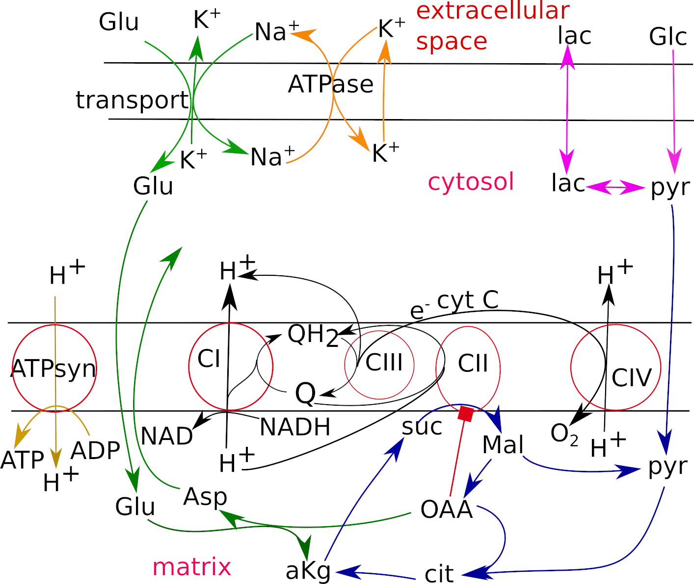

# Mitodyn
Version: 1.0



## Short Description

A kinetic model of mitochondrial respiration linked with cellular energetic metabolism and glutamate transport in neurons

## Description

The software tool “Mitodyn”, coded in C++,  supports an analysis of mitochondrial and cellular energy metabolism dynamics. It is based on a kinetic model, represented by a system of ordinary differential equations (ODEs). The model describes mitochondrial electron transport, biochemical reactions providing substrates for the electron transport, oxidative phosphorylation, ATP consumption, and transport of some metabolites through the cellular and inner mitochondrial membranes. It is customized for neuronal cells.

## Key features

- Simulates time course of model variables, which are the concentrations of metabolites and redox states of respiratory complexes described by the ODE system, production of reactive oxygen species (ROS) separately in various sites of the electron transport chain. 
- Allows programming the change of rate constants and concentrations in the course of a calculation, which simulates specific experimental conditions.
- Enables continuous calculations of dependencies of the steady state on model parameters. The latter can help to find the bifurcation characteristics of the system.

## Approaches

- Kinetic modeling
    
## Data Analysis

- simulation of dynamics of oxygen consumption, reactive oxygen species (ROS) production, metabolite concentrations

## Tool Authors

- Vitaly Selivanov (Universitat de Barcelona)

## Git Repository

- https://github.com/seliv55/cell_mito

## Installation

- To run Mitodyn in local computer it is sufficient to copy (clone) the repository and compile the code.
- The repository contains makefiles to compile the code using g++ compiler, which usually is installed by default in Linux operative systems. To use a different compiler the makefiles, which are located in root directory and other directories containing parts of the code ("con512tpl", "dasl", "integrT", "nrused") should be changed respectively.
- To compile the code the following command should be executed:
```
make clean && make 
```
- The compiler creates an executable binary file “mitodyn.out”. 

## Working with the program

- The repository has a script “mito.sh” that can be used to run Mitodyn.
- At runtime Mitodyn reads the input data: a file with initial values of the state variables and a file with the values of model parameters.
- The file “i1”, located in the repository, is an example of an input file with the initial values of the state variables. 
  * In this file, the initial values for the variables are represented by a column of numbers. The first 144 lines show the initial values for the redox states of complex III with two bound ubiquinones (Q), at Qo and Qi sites. Then 15 states of complex III core (no bound Q), 48 states for complex III with Q bound at Qo site, and 48 states for complex III with Q bound at Qi site are located. Then 15 states for complex I core and 48 states for complex I with bound Q are indicated. Then 11 states for complex II core and 36 states for complex II with bound Q are presented. Then 30 values for free QH2, mitochondrial and cellular membrane potentials, and metabolite concentrations with their nicknames, indicated on the left from the numbers, are shown.
- The file “1”, located in the repository, is an example file containing the values of model parameters.
  * In this file, each row indicates data for one parameter. Each line starts from an integer representing a parameter number. Next, a parameter nickname and a parameter value, a rate constant of respective electron transport or metabolic reaction, are indicated. Then after "//" a short scheme of respective electron transport or metabolic reaction is presented.
  * The parameters are presented in the following order: first 20 lines are for complex III reactions, then up to line 32 complex II parameters are given, then up to line 46 complex II parameters are shown, various metabolic reaction rate constants occupy rows up lo line 67, and finally the rate constants for outside concentrations are indicated.
- the paths to input files can be specified as default values in the script “mito.sh”, or as options in a command line:
``` 
cd [Mitodyn directory]
./mito.sh -i i1 -p 1
```
- different input files can be used, but they should have the same format exemplified in "1" and "i1".
- Taking into consideration the large number of state variables (>300) and parameters (~70), it is recommended to start the first analysis using the presented example files.
- Mitodyn can run in various modes:
  * If mode = "0", Mitodyn makes a single simulation and stops;
  * If mode = "r", it also makes a single simulation but assuming inhibition of complex I by rotenone;
  * mode = "cont" produces a series of simulations incrementing a parameter in some interval starting from the point achieved in the previous simulation (shortened word "continuation").
    * In this mode Mitodyn reads an additional file "cont" that specifies the number of points in the series, the number of a chosen parameter in the array of parameters, the starting value of the parameter, and the interval's size. This file existing in the root directory contains an example of such specification.
  * mode = "rc" is the same as "cont" but assuming inhibition of complex I by rotenone.
- the disirable mode should be specified as default in "mito.sh", or as options in command line:
```
./mito.sh -m cont
```
- During the analysis, the parameter values can be changed manually, running single simulations. The modified parameters can be saved in a different file and then used for subsequent analysis. The values of state variables obtained at the end of a single simulation are kept in the file “i0” as initial values for subsequent simulations.
- After performing a single simulation, Mitodyn saves the time course of variables of interest (mitochondrial membrane potential, Δψ), combinations of variables (e.g., a sum of potentially ROS producing redox states), and functions of variables (oxygen consumption rate, VO<sub>2</sub>) in a text file “dynamics”.
- If GNUplot is installed, it plots the saved data executing the GNUplot script “gplt.p”, presented in the above-mentioned directory. The plot is saved in the file “./kin/dynamics.png”.
- After running Mitodyn in the continuation mode, it saves the steady state values of the same variables and their combinations in the file “00000”, plots the dependence of selected steady state data executing the GNUplot script “gparplt.p”, and saves the plot “cont.png”.
- Here is an example of two single simulations:
```
./mito.sh
```

*Simulation of Ca2+ uptake. Dynamics of ubiquinol, A; the matrix pH, B; Δψ, C; ROS generation rates in complexes I (solid lines) and II (dashed lines), D, and in complex III, E; potentially ROS generating species, expressed as the ratio to the total amount of the complexes. External Ca2+ concentration, F. The curves marked as “1” correspond to the initial Ca2+ concentration of 5 nmol/mg prot, curves “2” to 9 nmol/mg prot, curves “3” to 12 nmol/mg prot,*


## Publications

1. Vitaly A. Selivanov, Olga A. Zagubnaya, Carles Foguet, Yaroslav R. Nartsissov, Marta Cascante. MITODYN: An open source software for quantitative modeling mitochondrial and cellular energy metabolic flux dynamics in health and disease.  Methods Mol Biol. In press.

2. Selivanov VA, Zagubnaya OA, Nartsissov YR, Cascante M. Unveiling a key role of oxaloacetate-glutamate interaction in regulation of respiration and ROS generation in nonsynaptic brain mitochondria using a kinetic model. PLoS One. 2021 Aug 3;16(8):e0255164.

3. Selivanov VA, Votyakova TV, Zeak JA, Trucco M, Roca J, Cascante M.
Bistability of mitochondrial respiration underlies paradoxical reactive oxygen
species generation induced by anoxia. PLoS Comput Biol. 2009 5(12):e1000619.

4. Selivanov VA, Votyakova TV, Pivtoraiko VN, Zeak J, Sukhomlin T, Trucco M,
Roca J, Cascante M. Reactive oxygen species production by forward and reverse
electron fluxes in the mitochondrial respiratory chain. PLoS Comput Biol. 2011
7(3):e1001115.

5. Selivanov VA, Cascante M, Friedman M, Schumaker MF, Trucco M, Votyakova TV.
Multistationary and oscillatory modes of free radicals generation by the
mitochondrial respiratory chain revealed by a bifurcation analysis. PLoS Comput
Biol. 2012 8(9):e1002700.
