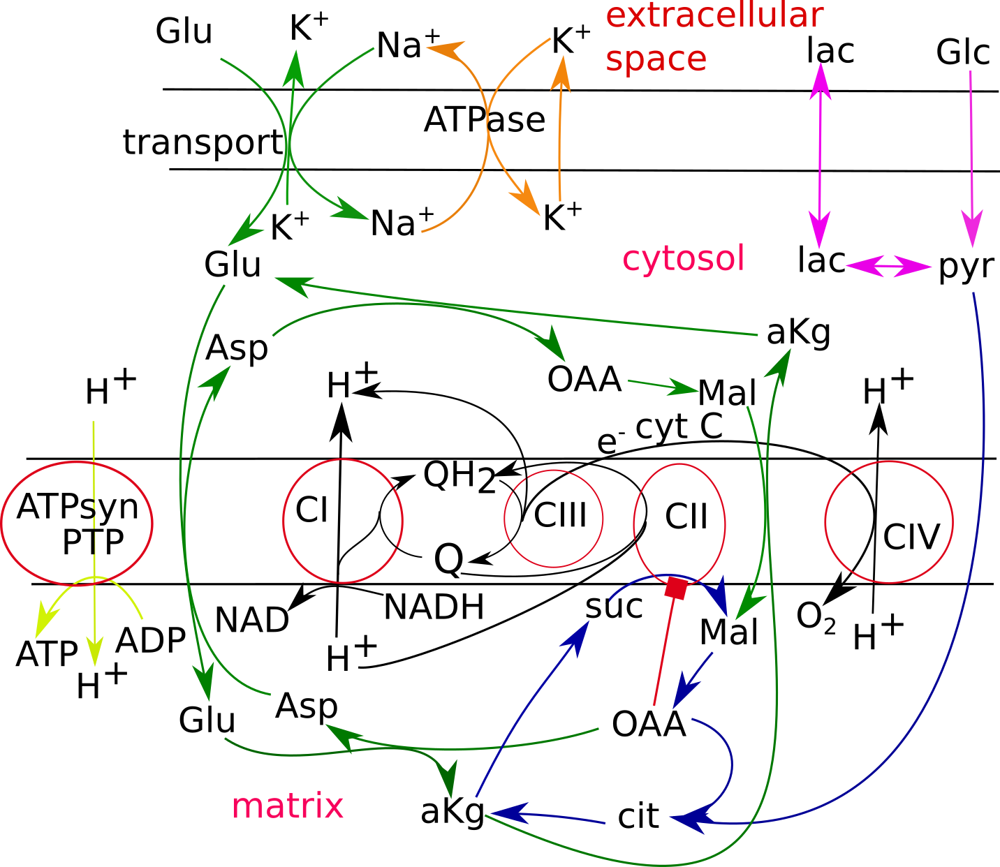

# Mitodyn
Version: 1.0

## Short Description

Kinetic model of mitochondrial respiration linked with cellular energetic metabolism and glutamate transport in neurons. Here a reduced version of the "complete" model (branch "complete") is presented.

## Description

The software tool “Mitodyn”, coded in C++,  supports an analysis of mitochondrial and cellular energy metabolism dynamics. The scheme of reactions implemented in this model is shown in Fig 1.



Fig 1.The scheme of reactions implemented in the reduced model. In the model, electron transport in each respiratory complex (CI, CII, CIII, CIV) is reduced to one equation. The model also describes glycolysis (violet arrows), the Krebs cycle (blue arrows), oxidative phosphorylation (ATP syn), ATP consumption (orange arrows), glutamate transport, and metabolism (green arrows).

The reduction consists in simplification of the equations describing the reactions catalyzed by respiratory complexes and reactions of the malate-aspartate shuttle.
<p/> The model also implements a possibility of mitochondrial permeability transition (MPT), i.e., a sudden nonspecific increase of permeability of the inner mitochondrial membrane for various ions and molecules weighting <1.5 kDa.

## Key features

- Simulates time course of model variables, which are the concentrations of metabolites shown in Fig 1 and described by the ODE system. 
- Allows to program the change of rate constants and concentrations in the course of a calculation, which simulate specific experimental conditions.
- Enables continuous calculations of dependencies of the system steady states on model parameters. The latter can help to find bifurcation characteristics of the system.

## Approaches

- Kinetic modeling
    
## Data Analysis

- simulation of dynamics of oxygen consumption, metabolite concentrations

## Tool Authors

- Vitaly Selivanov (Universitat de Barcelona)

## Git Repository

- https://github.com/seliv55/mito/tree/reduced

## Installation

-  To run Mitodyn it in local computer it is sufficient to copy (clone) the repository and compile the code.
- The repository contains makefiles to compile the code using g++ compiler, which usually is installed by default in Linux operative systems. To use a different compiler the makefiles, which are located in root directory and other directories containing parts of the code ("con512tpl", "dasl", "integrT", "nrused") should be changed respectively.
- To compile the code the following command should be executed:
```
make clean && make 
```
- The compiler creates an executable binary file “mitodyn.out”. 

## Working with the program

- The repository has a script “mito.sh” that can be used to run Mitodyn.
- At runtime Mitodyn reads the input data: a file with initial values of the state variables and a file with the values of model parameters.
- An example of an input file with the initial values of the state variables (“i1”) is presented in the repository. 
  * In this file, the initial values for the variables are presented. It keeps the initial values for redox states of the respiratory chain complexes for compatibility with the complete model. Complex III states occupy the First 255 lines. Then 63 states for complex I and 47 states for complex II. This reduced model uses only the last 14 values for free QH_2, mitochondrial and cellular membrane potentials, and metabolite concentrations with their nicknames, indicated on the left from the numbers.
  * An initial analysis can be started using the existing initial values file "i1". After simulations with changed parameters, Mitodyn saves the final values of variables in the file "i0" in the same format as "i1". This output file "i0" can be used for the following simulations as the initial values file.
- An example of the file with the values of model parameters (“1”) is also presented in the repository.
  * In this file, each row indicates data for one parameter. Each line consists of an integer representing a parameter number, a parameter nickname, and a parameter value, which is a rate constant of the respective metabolic reaction. Then after "//" a short scheme of the respective metabolic reaction is presented.
  * The rate constants for electron transport reactions inside the respiratory complexes, implemented in the complete model, are kept for compatibility with the latter. The parameters are presented in the following order: first 21 lines are for complex III reactions, then up to line 33 complex II parameters are given, then up to line 45 complex I parameters are shown, various metabolic reaction rate constants occupy rows up to line 68, and finally the outside concentrations are indicated.
- the paths to input files can be specified as default values in the script “mito.sh”, or as options (-i for the initial values, -p for the parameters) in a command line:
```
./mito.sh -m cont
```
- During the analysis, the parameter values can be changed manually, running single simulations. The changed parameters can be saved in a different file and then used for subsequent analysis. The values of state variables obtained at the end of a single simulation are saved in the file “i0” and can be used as initial values for subsequent simulations.
- After performing a single simulation, Mitodyn saves the time course of variables of interest (mitochondrial membrane potential, Δψ), combinations of variables (e.g., a sum of potentially ROS producing redox states), and functions of variables (oxygen consumption rate, VO<sub>2</sub>) in a text file “dynamics”.
- If GNUplot is installed, it plots the saved data executing the GNUplot script “gplt.p”, presented in the above-mentioned directory. The plot is saved in the file “./kin/dynamics.png”.
- After running Mitodyn in the continuation mode, it saves the steady-state values of the same variables and their combinations in the file “00000”, plots the dependence of selected steady state data executing the GNUplot script “gparplt.p”, and saves the plot “cont.png”.
- Here is an example of two single simulations:
```
./mito.sh
```

*Dynamics of some determinants of energy metabolism calculated by Mitodyn. Time course of Δψ (A), oxygen consumption (B), ubiquinol (QH2) content (C),  and ATP (D) are calculated for some basal state when ATP synthesis compensates its consumption (orange curves labeled as “work”) and ten-times decreased ATPase activity (blue curves labeled as “ROS”. The corresponding values of parameters and initial values of state variables are listed in the files “1” and “i1” respectively*

- Here is an example of two branches of stable steady states found by running Mitodyn in continuation mode:


*Two branches of stable steady-states revealed by running Mitodyn in “cont” mode. The steady states for semiquinone at Qo site of complex III (A) and oxygen consumption (B) as functions of the parameter that reflects ATP demand. The stable steady-states branch obtained by simulations gradually decreasing the parameter is shown in orange. It is terminated by a limit point (LP), and further decrease of the parameter switches the system to the blue branch of stable steady-states. With subsequent increasing the parameter, the system remains in the blue branch of stable steady-states. Mitodyn does not locate the branch of unstable steady states situated between the orange and blue branches and connected with the orange branch in the limit point.*
<p/> If the model simulates MPT, the latter can provoke sustained oscillations, as the following figure shows.


## Publications

1. Vitaly A. Selivanov, Olga A. Zagubnaya, Carles Foguet, Yaroslav R. Nartsissov, Marta Cascante. MITODYN: An open source software for quantitative modeling mitochondrial and cellular energy metabolic flux dynamics in health and disease.  Methods Mol Biol. In press.

2. Selivanov VA, Zagubnaya OA, Nartsissov YR, Cascante M. Unveiling a key role of oxaloacetate-glutamate interaction in regulation of respiration and ROS generation in nonsynaptic brain mitochondria using a kinetic model. PLoS One. 2021 Aug 3;16(8):e0255164.

3. Selivanov VA, Votyakova TV, Zeak JA, Trucco M, Roca J, Cascante M.
Bistability of mitochondrial respiration underlies paradoxical reactive oxygen
species generation induced by anoxia. PLoS Comput Biol. 2009 5(12):e1000619.

4. Selivanov VA, Votyakova TV, Pivtoraiko VN, Zeak J, Sukhomlin T, Trucco M,
Roca J, Cascante M. Reactive oxygen species production by forward and reverse
electron fluxes in the mitochondrial respiratory chain. PLoS Comput Biol. 2011
7(3):e1001115.

5. Selivanov VA, Cascante M, Friedman M, Schumaker MF, Trucco M, Votyakova TV.
Multistationary and oscillatory modes of free radicals generation by the
mitochondrial respiratory chain revealed by a bifurcation analysis. PLoS Comput
Biol. 2012 8(9):e1002700.
